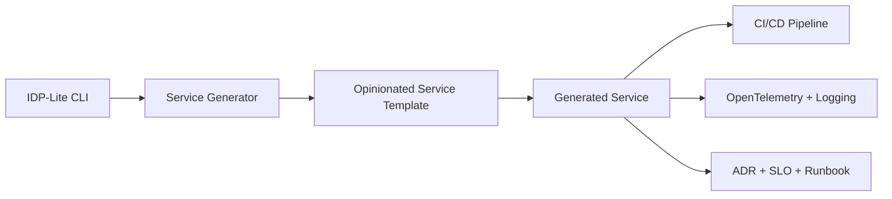

# Internal Developer Platform Lite

Golden-path service scaffolding CLI with built-in observability, CI/CD standards, and operational guardrails.

Internal Developer Platform Lite (IDP-Lite) is a reference implementation demonstrating how platform teams can standardize service creation through opinionated templates, baked-in quality controls, and operational readiness from day one.

This project is intentionally minimal. It is not a portal, not Backstage, and not an enterprise control plane. It is a focused demonstration of platform engineering principles in code.

---

## 🛡 What This Repository Demonstrates

- Golden-path service scaffolding
- Opinionated platform guardrails
- Built-in observability (OpenTelemetry + structured logging)
- CI/CD pipeline standards
- Strict TypeScript + lint enforcement
- Health endpoints and operational readiness
- ADR and SLO templates
- Platform-first engineering thinking

This repository models how to design engineering systems — not just individual services.

---

## 🎯 Purpose

Engineering organizations scale through consistency, not heroics.

IDP-Lite demonstrates how a platform team can:

- Reduce cognitive load for service teams
- Enforce architectural standards
- Bake observability in from day one
- Standardize CI/CD workflows
- Encourage documentation discipline
- Improve delivery reliability across teams

It represents a "golden path" approach to service creation.

---

## 🏗 Conceptual Architecture



The CLI generates a production-ready service skeleton with platform guardrails preconfigured.

---

## 🚀 Example Usage

```bash
npx idp-lite create orders-service
```

Generated output:

```
orders-service/
  src/
    index.ts
    health.ts
    telemetry.ts
    logger.ts
  test/
  Dockerfile
  .github/workflows/ci.yml
  tsconfig.json
  .eslintrc.json
  package.json
  docs/
    adr/
      ADR-0001.md
    slo.md
    runbook.md
```

---

## 🔍 Built-In Guardrails

### Observability
- OpenTelemetry tracing baseline
- Structured JSON logging
- Correlation ID middleware
- Health endpoints

### Delivery Standards
- CI workflow (lint → test → build → docker)
- Coverage threshold enforcement
- Dockerized service template

### Quality Controls
- Strict TypeScript configuration
- ESLint rules
- Test scaffold

### Operational Discipline
- ADR template
- SLO template
- Runbook template

---

## 📐 Design Principles

1. Opinionated over flexible
2. Guardrails over guidelines
3. Observability by default
4. Documentation as a first-class artifact
5. Delivery standards embedded in scaffolding
6. Extensible template architecture

---

## 📌 Intended Audience

- Platform Engineers
- Principal / Staff Engineers
- Engineering Managers
- DevEx teams
- Organizations establishing internal platform standards

---

## 📌 Status

Reference implementation focused on demonstrating platform engineering patterns through a minimal but realistic CLI-based golden path generator.

