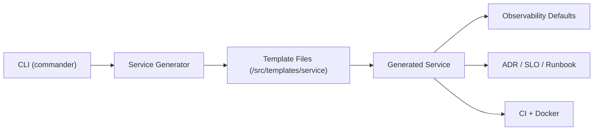

# Internal Developer Platform Lite

[](#what-it-is)
[](#quick-start)
[](#built-in-guardrails)
[](#generated-structure)
[](#built-in-guardrails)
[](#built-in-guardrails)

A minimal Internal Developer Platform (IDP) reference implementation focused on a CLI-based golden path service generator.

## What It Is

`idp-lite` generates production-ready service skeletons with opinionated defaults:

- Fastify API scaffold
- Strict TypeScript configuration
- OpenTelemetry baseline
- Structured JSON logging with correlation IDs
- Health/readiness endpoints
- GitHub Actions CI (lint -> test -> coverage gate -> build -> docker build)
- Dockerfile
- Documentation templates (ADR, SLO, Runbook)

This repository is intentionally lite: no portal, no UI control plane, no Backstage.

## Why Lite

- Platform value is in fast, consistent service creation and guardrails.
- Teams get operational readiness on day one without a platform UI rollout.
- The architecture stays maintainable: CLI parsing, generation logic, and templates are separated.

## Quick Start

```bash
npm install
npm run build
node dist/cli.js create demo-service
```

Optional output path:

```bash
node dist/cli.js create demo-service --out ./services/demo-service
```

## Run With Docker

Build a named image (avoids dangling `<none>:<none>` images):

```bash
cd demo-service
docker build -t demo-service:local .
```

Run with port publishing so the host can reach the service:

```bash
docker run --rm --name demo-service -p 3000:3000 demo-service:local
```

Test endpoints from another terminal:

```bash
curl http://127.0.0.1:3000/health
curl http://127.0.0.1:3000/ready
```

If starting from Docker Desktop UI, ensure container port `3000` is published to host port `3000`.

## Generated Structure

```text
demo-service/
  src/
    index.ts
    health.ts
    logger.ts
    telemetry.ts
  test/
    health.test.ts
  docs/
    adr/ADR-0001.md
    slo.md
    runbook.md
  .github/workflows/ci.yml
  .eslintrc.json
  Dockerfile
  package.json
  tsconfig.json
  vitest.config.ts
```

## Built-In Guardrails

- Observability by default (OpenTelemetry + structured logs + correlation IDs)
- Quality baseline (strict TypeScript + ESLint + tests)
- Delivery standards (CI pipeline with coverage threshold)
- Operational readiness (health endpoints + runbook/SLO/ADR templates)

## Conceptual Architecture



## Repository Docs

- `docs/architecture.md` for layering and extension model
- `docs/platform-principles.md` for platform design principles
