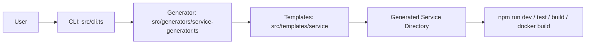
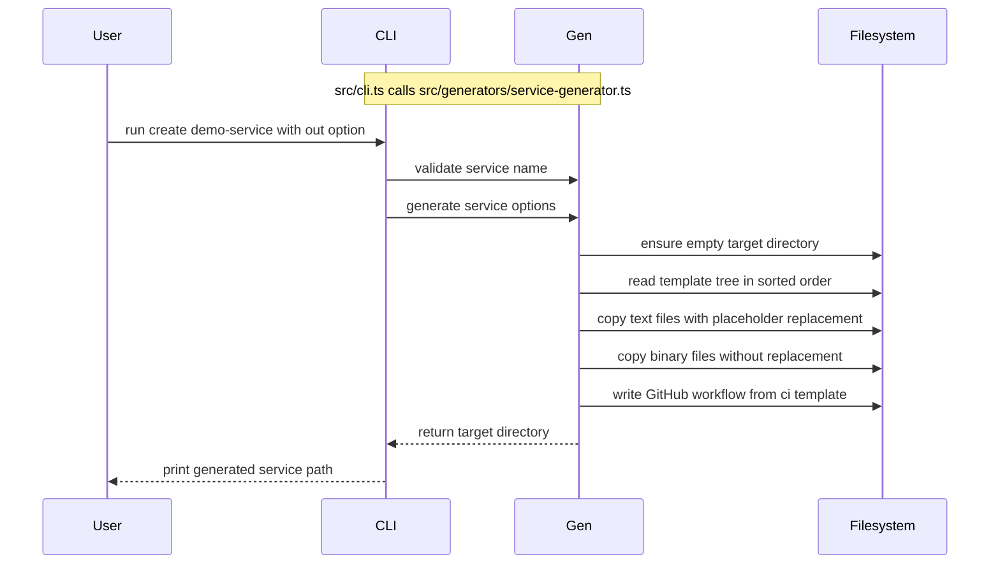
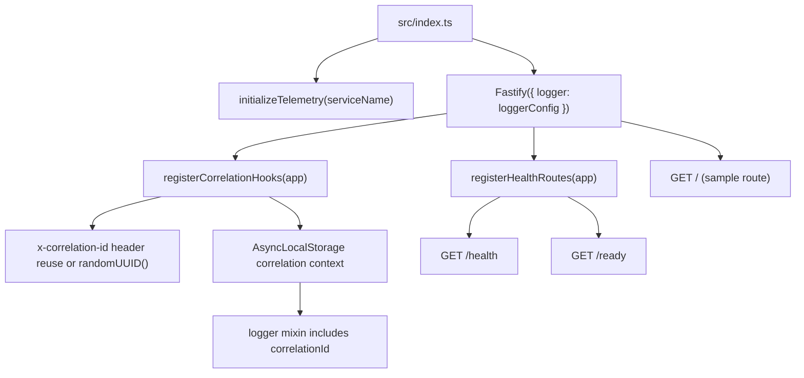
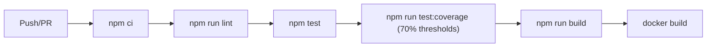

# Architecture

## Overview

`internal-developer-platform-lite` is a CLI-first IDP reference implementation.
Its core design goal is simple and opinionated: generate production-ready service baselines with platform guardrails built in.

Primary command:

- `idp-lite create <service-name> [--out <path>]`

## Repository Layering

The codebase is intentionally separated into three layers:

1. CLI layer: command parsing and user interaction (`src/cli.ts`)
2. Generation layer: filesystem operations, validation, deterministic output (`src/generators/service-generator.ts`)
3. Template layer: golden-path service assets (`src/templates/service/**`)

## Generation Sequence

The runtime behavior of `create` is intentionally small and deterministic.

## Determinism and Safety

These behaviors are implemented directly in `src/generators/service-generator.ts`:

- Stable ordering:
  - Directory entries are sorted with `compareNames`.
- Stable text normalization:
  - `normalizeNewlines` converts CRLF to LF before write.
- Placeholder replacement:
  - Tokens: `__SERVICE_NAME__`, `__SERVICE_NAME_PASCAL__`, `__GENERATED_DATE_ISO__`.
- Service name validation:
  - Regex enforces kebab-case-like names (`payments-api`, `orders-v2`).
- Binary-safe copying:
  - Known binary extensions are copied raw.
  - NUL-byte scan prevents accidental text replacement on binary content.
- Directory skip rules:
  - Ignores `.git`, `.idea`, `.vscode`, `coverage`, `dist`, `node_modules`.
- Output path guardrails:
  - Target must be either non-existent or an empty directory.

## Generated Service Architecture

The template in `src/templates/service` produces a Fastify service with observability and operational defaults:

### Source-level mapping

- Server bootstrap: `src/templates/service/src/index.ts`
- Health and readiness routes: `src/templates/service/src/health.ts`
- Logging configuration: `src/templates/service/src/logger.ts`
- Telemetry and correlation hooks: `src/templates/service/src/telemetry.ts`
- Health test scaffold: `src/templates/service/test/health.test.ts`

## Delivery Pipeline in Template

The generated workflow (`.github/workflows/ci.yml`) runs on push to `main` and all pull requests.

Node setup is pinned to Node 20 with npm cache enabled.

## Extension Model

Preferred extension order:

1. Template-first changes:
  - Update service defaults in `src/templates/service/**`.
2. Generator changes only when needed:
  - Add new placeholders, write rules, or output conventions in `src/generators/service-generator.ts`.
3. CLI changes last:
  - Add/modify commands in `src/cli.ts` only when user-facing behavior must change.

This keeps ownership boundaries clear and avoids coupling command parsing to filesystem implementation details.

## Non-goals

- No developer portal/UI
- No control-plane orchestration
- No dynamic template engine

The architecture deliberately optimizes for maintainability, auditability, and low cognitive load over feature breadth.
